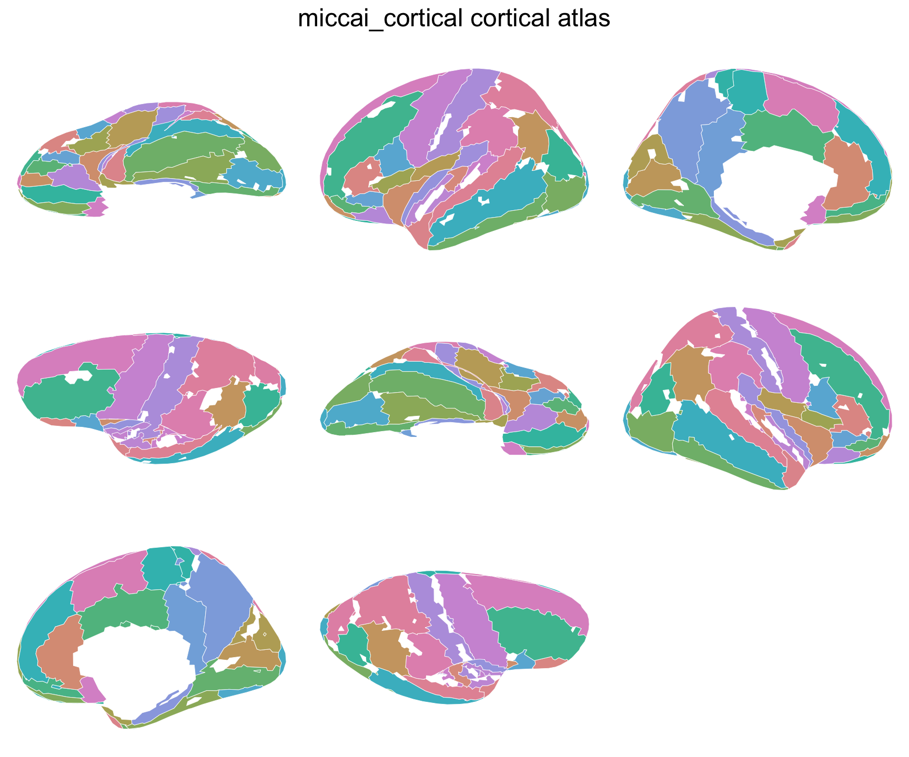
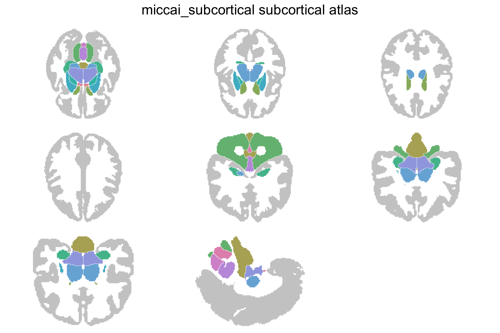

# ggsegMiccai

MICCAI 2012 Multi-Atlas Labeling brain atlas for the ggseg ecosystem:
the maximum probability tissue labels distributed with SPM12, split into
a cortical atlas
([`miccai_cortical()`](https://ggsegverse.github.io/ggsegMiccai/reference/miccai_cortical.md))
and a subcortical atlas
([`miccai_subcortical()`](https://ggsegverse.github.io/ggsegMiccai/reference/miccai_subcortical.md)).

## Data licence

The label data were released under the Creative Commons
Attribution-NonCommercial licence (CC BY-NC), so this package is CC
BY-NC 4.0 and may not be used commercially. Credit the MRI scans as
originating from the [OASIS project](https://www.oasis-brains.org/) and
the labeled data as “provided by [Neuromorphometrics,
Inc.](http://Neuromorphometrics.com/) under academic subscription”.

## Atlas Citation

> Landman BA, Warfield SK (Eds.) (2012). *MICCAI 2012 Workshop on
> Multi-Atlas Labeling*.

> Marcus DS, et al. (2007). Open Access Series of Imaging Studies
> (OASIS): cross-sectional MRI data in young, middle aged, nondemented,
> and demented older adults. *Journal of Cognitive Neuroscience*, 19(9),
> 1498-1507. DOI:
> [10.1162/jocn.2007.19.9.1498](https://doi.org/10.1162/jocn.2007.19.9.1498)

If you use this atlas in your work, please cite both the original atlas
publication and the ggseg package:

> Mowinckel AM, Vidal-Pineiro D (2020). “Visualization of Brain
> Statistics With R Packages ggseg and ggseg3d.” *Advances in Methods
> and Practices in Psychological Science*, 3(4), 466-483. DOI:
> [10.1177/2515245920928009](https://doi.org/10.1177/2515245920928009)

## Installation

We recommend installing the ggseg-atlases through the ggsegverse
[r-universe](https://ggsegverse.r-universe.dev/#builds):

``` r

options(repos = c(
  ggsegverse = "https://ggsegverse.r-universe.dev",
  CRAN = "https://cloud.r-project.org"
))

install.packages("ggsegMiccai")
```

You can install this package from [GitHub](https://github.com/) with:

``` r

# install.packages("pak")
pak::pak("ggsegverse/ggsegMiccai")
```

## Usage

``` r

library(ggsegMiccai)

plot(miccai_cortical())
```



``` r

plot(miccai_subcortical())
```



## Code of Conduct

Please note that the ggsegMiccai project is released with a [Contributor
Code of
Conduct](https://contributor-covenant.org/version/2/1/CODE_OF_CONDUCT.html).
By contributing to this project, you agree to abide by its terms.
